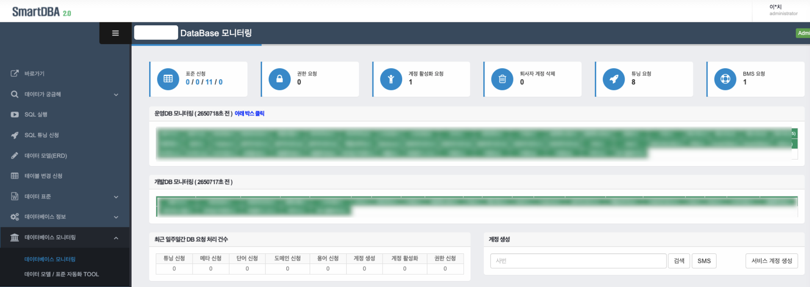
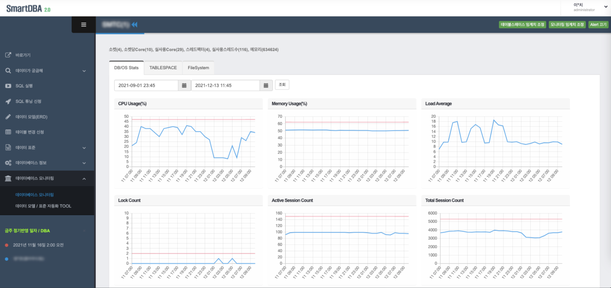
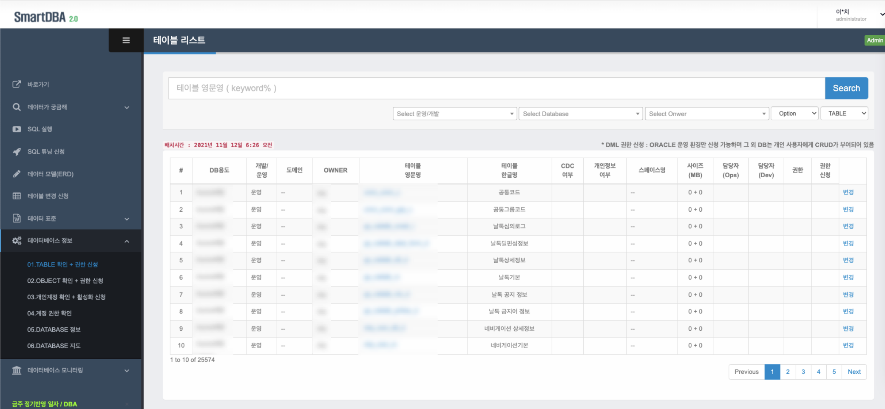
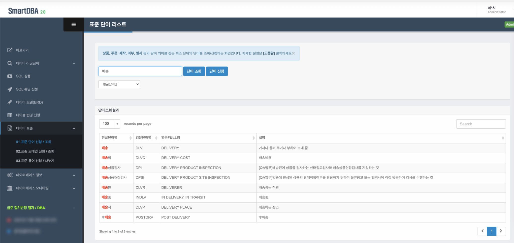
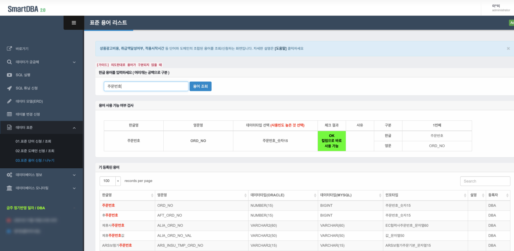
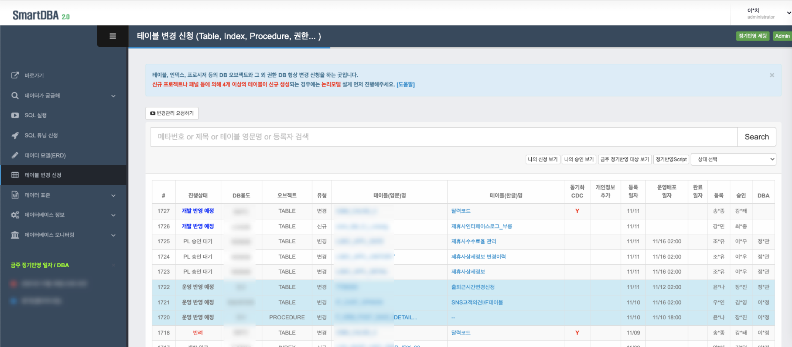
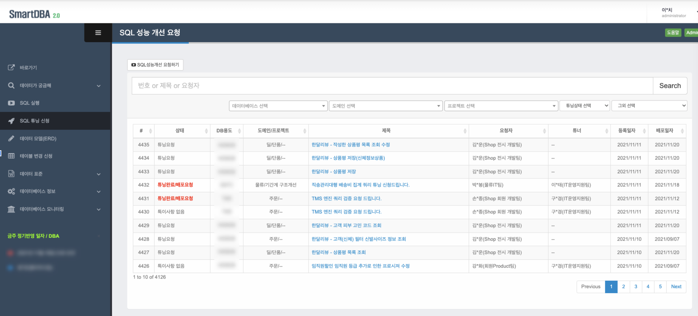
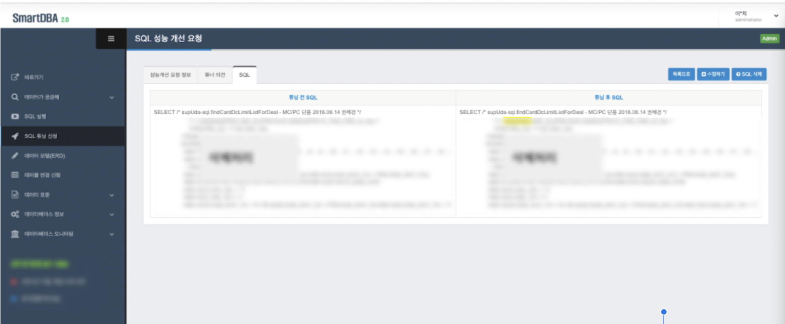
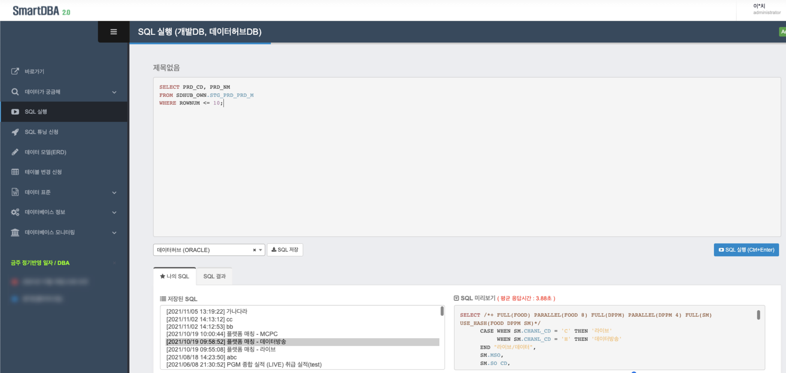
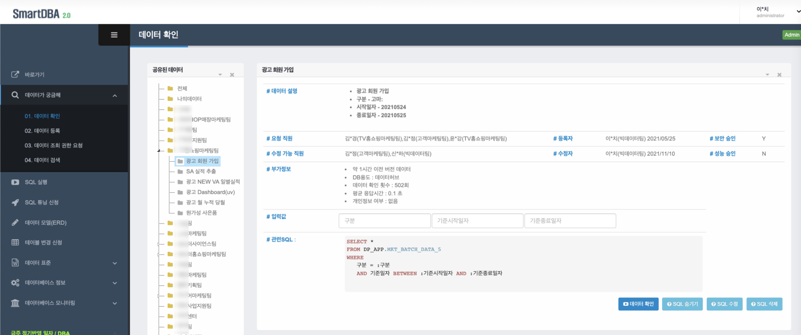

## SmartDBA (데이터포털) 
SmartDBA (데이터포털)는 데이터를  누구나 쉽게 활용할 수 있도록 돕기 위해 모델 설계부터 데이터 파이프라인, 그리고 웹서비스까지 직접 개발/구축한 데이터 셀프 서비스입니다.

## Service
- Django
- MySQL

## 대시보드
- 전사 DB(운영/개발) 모니터링
- 작업 자동화 ( 표준, 권한, 계정, 튜닝 등 )

## DB 모니터링
- DB Stat  (CPU, Memory, Load Average, Lock, Tablespace, FS 등 )
- 임계치 설정, Alert

## 데이터베이스/오브젝트 정보
- 테이블/컬럼 상세
- Object 상세 ( Procedure, Function, Seq, View 등 소스 포함 )
- 테이블 DML 권한 신청

## 메타 관리 (단어/용어)
- 단어, 도메인, 용어 조회
- 신청 및 승인 관리

## 테이블 변경관리
- 형상 관리
- 배포 관리
- 승인 관리

## SQL튜닝
- SQL 튜닝 요청
- SQL 배포 관리
- SQL 이력 관리

## SQL실행
- 데이터베이스 별 SQL 질의
- 개인 SQL 저장
- 동료 간 SQL 공유

## 데이터가 궁금해(현업)
- 데이터 SELF 활용
- 팀별 데이터 공유
- 바인딩 변수를 통한 SQL 질의
# smartdba
