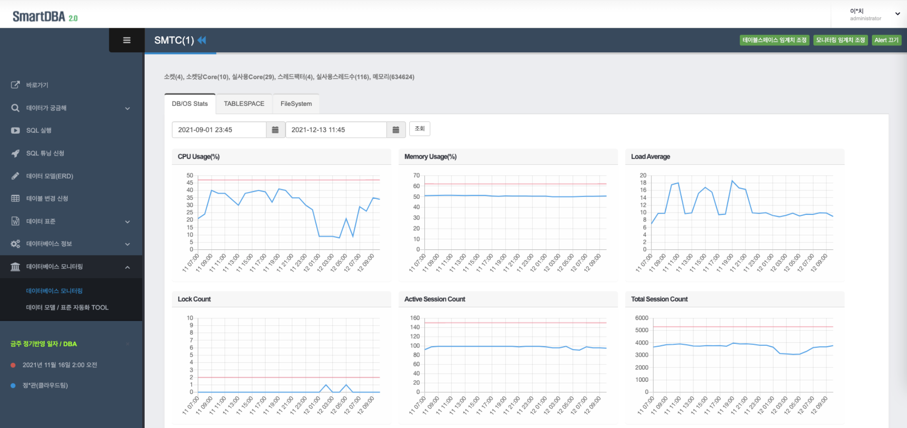

## SmartDBA (데이터포털) 
SmartDBA (데이터포털)는 데이터를  누구나 쉽게 활용할 수 있도록 돕기 위해 모델 설계부터 데이터 파이프라인, 그리고 웹서비스까지 직접 개발/구축한 데이터 셀프 서비스입니다.

## Service
- Django
- MySQL

## 대시보드

## DB 모니터링

## 데이터베이스 정보

## 메타 관리 (단어/용어)

## 테이블 변경관리

## SQL튜닝 

## SQL실행

## 데이터가 궁금해(현업)
# smartdba
